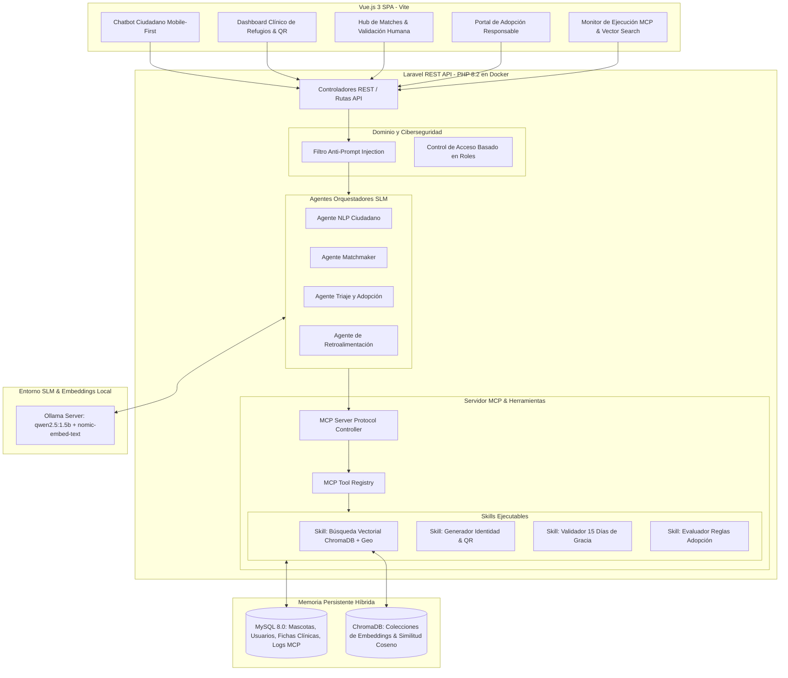

# RefuGuía 🐾
### Sistema Inteligente de Reconocimiento, Gestión y Reubicación de Mascotas Post-Sismo
**Trabajo Final de Ciclo — Inteligencia Artificial Aplicada a Organizaciones**  
*Universidad Tecnológica Nacional (UTN-FRBA) & EPIData*

---

## 🔗 Links Obligatorios de Evaluación

| Recurso | URL Directa |
| :--- | :--- |
| **Repositorio GitHub** | [https://github.com/vrivasdev/refu-guia](https://github.com/vrivasdev/refu-guia) |
| **Aplicación Web en Producción** | [https://refuguia.org](https://refuguia.org) *(O entorno Docker local)* |
| **Video de Demostración (< 3 min)** | [https://youtu.be/refuguia-demo-final](https://youtu.be/refuguia-demo-final) |
| **Documento del Anteproyecto** | [Ver PDF Anteproyecto](doc/Sistema%20Inteligente%20de%20Reconocimiento,%20Gestión%20y%20Reubicación%20de%20Mascotas%20Post-Sismo.pdf) |

---

## 1. Presentación del Proyecto
* **Autor / Integrante:** Víctor Rivas (Cohorte 2)
* **Problema que Resuelve:** Tras los severos eventos sísmicos en Venezuela, miles de animales de compañía fueron desplazados, colapsando los refugios y dispersando reportes caóticos en redes sociales. RefuGuía centraliza, identifica mediante visión/NLP y empareja mascotas con sus familias originales de forma automatizada y offline.
* **Público Objetivo:** Familias damnificadas, brigadas de rescatistas voluntarios, directores de refugios temporales y postulantes a adopción responsable.

---

## 2. Arquitectura del Sistema



---

## 3. Stack Tecnológico

| Componente | Tecnología / Herramienta | Por qué se eligió esta y no otra |
| :--- | :--- | :--- |
| **Frontend** | Vue.js 3 + Vite + CSS Vanilla Moderno | Reactividad ágil, bajo peso para carga en redes móviles inestables post-sismo y separación limpia de componentes. |
| **Backend** | Laravel 10 (PHP 8.2) REST API | Robustez en reglas de negocio, ORM Eloquent para trazabilidad de datos y rapidez en construcción de controladores seguros. |
| **Base de Datos Relacional** | MySQL 8.0 | Garantiza integridad transaccional, llaves foráneas y soporte ACID para expedientes clínicos y auditorías SHA-256. |
| **Base de Datos Vectorial** | ChromaDB (Contenedor Docker) | Almacenamiento ágil de embeddings fenotípicos/semánticos y cálculo nativo de similitud del coseno sin costos de licencia. |
| **Modelo de IA (SLM Local)** | Qwen 2.5 (1.5B) vía Ollama | Corre 100% offline en laptops de refugio con bajo consumo de RAM (~1.2GB), respetando la privacidad de los damnificados. |
| **Protocolo de Integración** | Model Context Protocol (MCP) | Estandariza la invocación segura de Skills (herramientas) por parte del modelo SLM sin permitir acceso no controlado a la BD. |
| **Contenerización** | Docker & Docker Compose | Aislamiento y reproducibilidad total del entorno en cualquier máquina con un solo comando. |

---

## 4. Evaluación UX/UI (5 Heurísticas de Nielsen)

1. **Visibilidad del Estado del Sistema:** El usuario recibe feedback instantáneo en el chat con chips de *"Extrayendo entidades..."* y porcentajes de confianza en tiempo real.
2. **Coincidencia con el Mundo Real:** Se utilizan términos clínicos habituales de veterinaria y conceptos de refugio accesibles (collar QR, período de gracia, reencuentro).
3. **Control y Libertad del Usuario:** Los rescatistas y tutores pueden confirmar o descartar manualmente los emparejamientos propuestos por la IA (*Human-in-the-Loop*).
4. **Prevención de Errores:** Bloqueo en frontend y backend de la administración de fármacos si no se ha confirmado el escaneo previo del código QR.
5. **Diseño Estético y Minimalista:** Interfaz oscura adaptada para bajo consumo de batería y alta legibilidad en pantallas táctiles de campamentos.

---

## 5. Matriz de Ciberseguridad

| Riesgo Identificado | Tipo (OWASP / Privacidad / Acceso) | Medida Implementada / Decisión Tomada |
| :--- | :--- | :--- |
| **Inyección de Prompt en SLM** | OWASP LLM01: Prompt Injection | `PromptSanitizerService` en Laravel filtra patrones maliciosos (`ignore instructions`, `bypass`, `system:`) antes de la inferencia. |
| **Exposición de Secretos y Llaves** | Secretos en Código | Uso de variables `.env` protegidas e ignoradas en `.gitignore`; credenciales de DB aisladas en Docker. |
| **Fuga de Datos de Damnificados** | Privacidad | Inferencia 100% Local con Ollama. Ningún dato sensible de las familias sale a servicios en la nube. |
| **Administración Incorrecta de Medicinas** | Control de Acceso / Integridad | Bloqueo estricto (*Hard-Stop*) en endpoint clínico si no se valida el UUID del QR físico. |

---

## 6. Despliegue Rápido con Docker

```bash
# 1. Clonar repositorio
git clone https://github.com/vrivasdev/refu-guia.git
cd refu-guia

# 2. Levantar todos los servicios en segundo plano
docker compose up -d --build

# 3. Acceso a las aplicaciones:
# - Frontend: http://localhost:5173
# - Backend API: http://localhost:8000/api/health
# - ChromaDB Vectorial: http://localhost:8001
# - MySQL: localhost:3306
```
