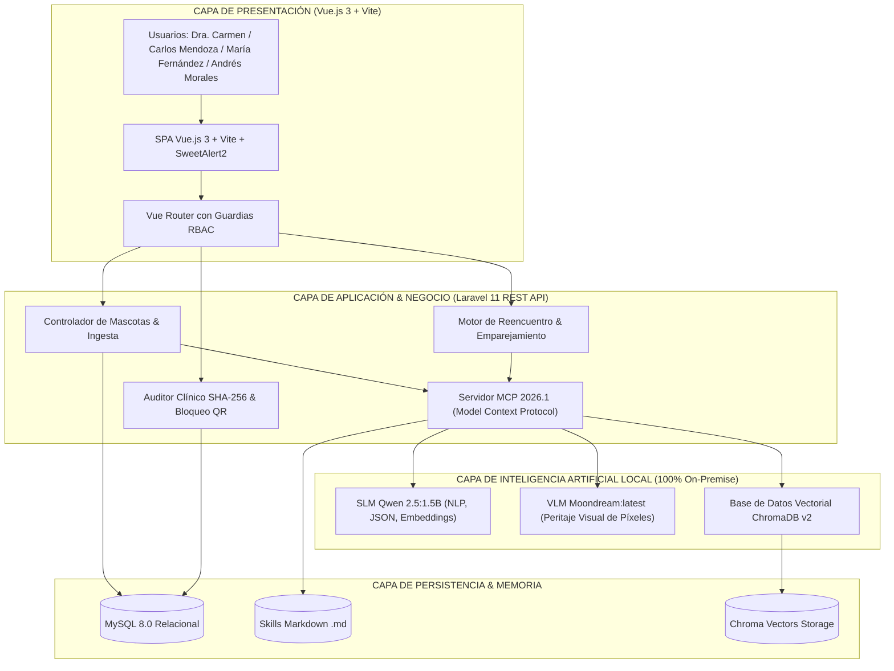

# RefuGuía 🐾
### Sistema Integral Multi-Agente On-Premise con IA Local (SLM+VLM), Protocolo MCP y Trazabilidad Médica Inmutable Post-Sismo
**Trabajo Final de Ciclo — Inteligencia Artificial Aplicada a Organizaciones**  
*Universidad Tecnológica Nacional (UTN-FRBA) & EPIData*

---

## 🔗 Enlaces y Entregables Oficiales

| Entregable / Recurso | Enlace Directo |
| :--- | :--- |
| **Repositorio GitHub** | [https://github.com/vrivasdev/refu-guia](https://github.com/vrivasdev/refu-guia) |
| **Informe Técnico Final Oficial (PDF)** | [doc/INFORME_FINAL_REFUGUIA_PARTE2.pdf](doc/INFORME_FINAL_REFUGUIA_PARTE2.pdf) |
| **Informe Técnico Final Editable (DOCX)** | [doc/INFORME_FINAL_REFUGUIA_PARTE2.docx](doc/INFORME_FINAL_REFUGUIA_PARTE2.docx) |
| **Registro de Auditoría de Sesión Real (TXT)** | [doc/LOG_SESION_REAL_REFUGUIA.txt](doc/LOG_SESION_REAL_REFUGUIA.txt) |
| **Guía de Pruebas Manuales por Roles (MD)** | [doc/GUIA_PRUEBAS_MANUALES_ROLES.md](doc/GUIA_PRUEBAS_MANUALES_ROLES.md) |

---

## 1. Presentación del Proyecto
* **Autor / Integrante:** Víctor Rivas (Full-Cycle AI Engineer)
* **Problema que Resuelve:** Tras desastres naturales como el sismo de Caracas (6.2 Mw), el colapso de las telecomunicaciones genera extravío masivo de mascotas, saturación de refugios en papel, falta de trazabilidad en fármacos críticos y ausencia de auditoría del período legal de 15 días antes de dar en adopción.
* **Solución Implementada:** Plataforma 100% On-Premise y soberana con inferencia local dual (SLM Qwen 2.5 + VLM Moondream), búsqueda semántica K-NN en ChromaDB, servidor MCP 2026.1 con 6 Skills agénticas auditables en Markdown, inmutabilidad SHA-256 en tratamientos y generación de collares QR de campaña.

---

## 2. Arquitectura General y Flujo de Datos



---

## 3. Catálogo de Skills Agénticas MCP (Model Context Protocol 2026.1)

El sistema implementa 6 Skills formales basadas en contratos Markdown (`storage/app/skills/*.md`):

1. **`skill_extraer_entidades_nlp`** (*Agente_NLP_Ingesta*): Sanitiza prompts y extrae entidades fenotípicas/clínicas en JSON estricto vía Qwen 2.5 (1.5B).
2. **`skill_peritaje_visual_moondream`** (*Agente_Peritaje_Visual_VLM*): Inspección y cotejo fotográfico píxel a píxel identificando manto, orejas y marcas distintivas con Moondream (1.4B).
3. **`skill_calcular_similitud_vectorial`** (*Agente_Matchmaker*): Matriz híbrida de similitud (40% visual + 30% semántica + 30% distancia Haversine).
4. **`skill_verificar_periodo_gracia`** (*Agente_Auditor_Legal*): Auditoría del período legal inamovible de 15 días continuos de búsqueda pública antes de la adopción.
5. **`skill_evaluar_compatibilidad_adopcion`** (*Agente_Triaje_Adopcion*): Evaluación automática de solvencia e idoneidad habitacional para adoptantes.
6. **`skill_generar_identidad_qr`** (*Agente_Trazabilidad_QR*): Generación de UUIDs inmutables y collares QR físicos imprimibles.

---

## 4. Roles y Flujo de Usuarios en el Sistema

* 👩‍⚕️ **Dra. Carmen López (Coordinadora de Refugio):** Gestión de inventario, auditoría de fármacos con hash inmutable SHA-256 y confirmación de reencuentros.
* 👷 **Carlos Mendoza (Rescatista de Campo):** Ingreso rápido de animales por voz/texto en zona de rescate e impresión de collares QR.
* 👩 **María Fernández (Damnificada):** Reporte de búsqueda familiar con foto, recepción de coincidencias sugeridas y peritaje visual.
* 👨 **Andrés Morales (Adoptante Responsable):** Exploración de catálogo habilitado (>15 días) y postulación con triaje de idoneidad IA.

---

## 5. Ciberseguridad y Trazabilidad Médica

* **Anti-Prompt Injection:** Servicio `PromptSanitizerService` para bloquear ataques de inyección y Jailbreak en el SLM.
* **Trazabilidad Médica SHA-256:** Encadenamiento criptográfico `hash_sha256 = sha256(prev_hash + payload)` en cada tratamiento administrado.
* **Bloqueo Físico por QR:** Validación obligatoria del escaneo de collar (`qr_scanned = true`) antes de aplicar fármacos críticos.
* **Zero Data Leakage:** Inferencia 100% On-Premise sin envío de datos privados a la nube comercial.

---

## 6. Despliegue Rápido On-Premise

```bash
# 1. Clonar el repositorio
git clone https://github.com/vrivasdev/refu-guia.git
cd refu-guia

# 2. Iniciar modelos IA en Ollama Local
ollama run qwen2.5:1.5b
ollama run moondream:latest

# 3. Levantar la plataforma completa en Docker
docker compose up -d --build

# 4. URLs de acceso local:
# - Frontend SPA: http://localhost:5173
# - Backend API:  http://localhost:8000/api/health
# - ChromaDB:     http://localhost:8001
# - MySQL:        localhost:3306
```

---
*UTN-FRBA & EPIData — Programa de Inteligencia Artificial Aplicada a Organizaciones*
