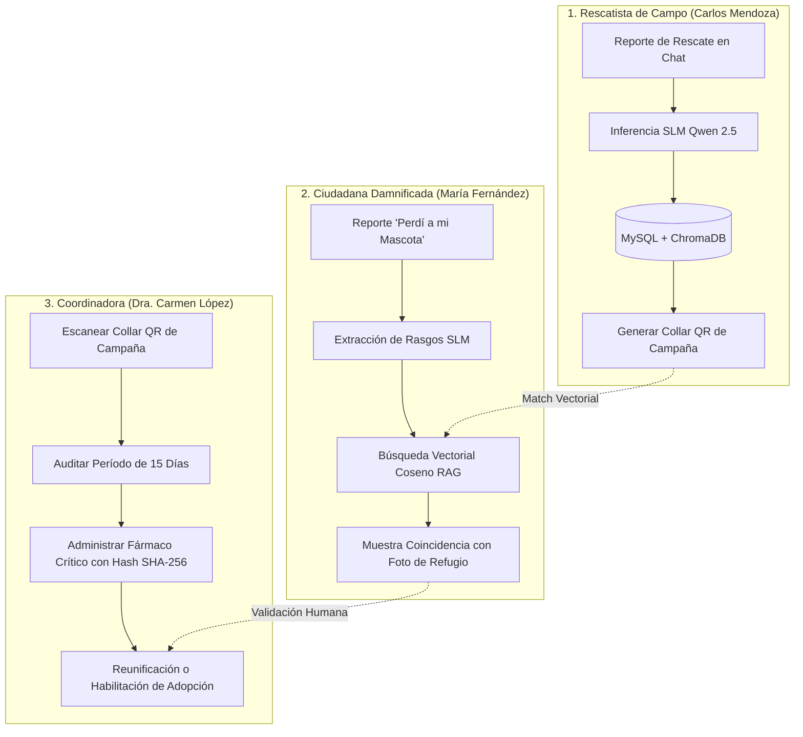

# 📋 MATRIZ OFICIAL DE CASOS DE USO Y GUÍA DE PRUEBAS MANUALES (QA SENIOR)
**Proyecto:** RefuGuía (Sistema Agéntico Local Post-Sismo)  
**Entorno de Pruebas:** Localhost (`Frontend: http://localhost:5173` | `Backend API: http://localhost:8000`)  
**Arquitectura de IA:** SLM Local (`qwen2.5:1.5b` vía Ollama en `host.docker.internal:11434`) + Base de Datos Vectorial (`ChromaDB v2`) + Inmutabilidad Criptográfica SHA-256 en MySQL.

---

## 👥 1. MATRIZ DE USUARIOS Y ROLES (RBAC)

| Rol del Sistema | Nombre de Usuario | Correo Electrónico | Contraseña | Alcance y Permisos |
| :--- | :--- | :--- | :--- | :--- |
| **Coordinadora de Refugio** | Dra. Carmen López | `carmen.lopez@refuguia.org` | `carmen123` | Control Total: Triage, Inventario, Historial Clínico SHA-256, Descarga/Impresión QR, Edición de Fichas y Diagnóstico SLM. |
| **Rescatista de Campo** | Carlos Mendoza | `carlos.mendoza@refuguia.org` | `carlos123` | Registro de rescates en campo, generación e impresión de collares QR de campaña, consulta de inventario. |
| **Ciudadana Damnificada** | María Fernández | `maria.fernandez@gmail.com` | `maria123` | Búsqueda familiar en lenguaje natural / nota de voz, cotejo vectorial RAG en tiempo real contra refugios. *(Sin acceso a datos técnicos ni QR).* |
| **Adoptante Post-Sismo** | Andrés Morales | `andres.morales@gmail.com` | `andres123` | Postulación y evaluación de idoneidad con IA para mascotas con período legal de 15 días cumplido. |

---

## 🧪 2. CASOS DE USO DETALLADOS POR ROL

---

### 🔹 CASO DE USO 1: RESCATISTA DE CAMPO (Carlos Mendoza)
* **Objetivo:** Registrar un canino herido rescatado en zona de desastre (Caricuao) y generar su collar QR físico.
* **Precondición:** Iniciar sesión con `carlos.mendoza@refuguia.org` / `carlos123` (o seleccionar en el selector de rol superior).

| Paso | Acción del Evaluador | Resultado Esperado (Criterio de Aceptación QA) |
| :---: | :--- | :--- |
| **1.1** | Ir a la pestaña **`Chat Ciudadano`** (`http://localhost:5173/`). | La interfaz muestra el banner del rescatista: *"Ingreso de Rescates y Triage de Campo"* y únicamente la tarjeta **`🏡 Registrar Mascota Rescatada en Campo`**. |
| **1.2** | Hacer clic en la tarjeta rápida o dictar por voz / escribir:   `"Rescatamos a un perro mestizo mediano negro con manchas blancas en el pecho cerca de Caricuao. Tiene la pata lastimada."` | El modelo local `qwen2.5:1.5b` extrae especie (`canine`), color (`negro y blanco`), tamaño (`medium`), trauma (`pata lastimada`) y ubicación (`Caricuao`). |
| **1.3** | Opcional: Adjuntar una foto con el botón **`📷 Subir Foto`** y hacer clic en **`Enviar 🚀`**. | El sistema crea el registro en MySQL, genera el embedding vectorial en ChromaDB v2 y **renderiza la tarjeta del Collar QR oficial** (`RG-2026-XXXXXX`) con botón directo al inventario. |

---

### 🔹 CASO DE USO 2: CIUDADANA DAMNIFICADA (María Fernández)
* **Objetivo:** Buscar a su perro extraviado mediante descripción en lenguaje natural y encontrar coincidencias con los animales en refugios.
* **Precondición:** Cambiar al usuario `María Fernández (Damnificada)` en el selector de rol superior.

| Paso | Acción del Evaluador | Resultado Esperado (Criterio de Aceptación QA) |
| :---: | :--- | :--- |
| **2.1** | Ir a la pestaña **`Chat Ciudadano`** (`http://localhost:5173/`). | La vista muestra el banner empático: *"Búsqueda Familiar y Asistente Ciudadano"* y **únicamente la tarjeta `🔍 Reportar Mascota Extraviada`** *(Cero botones de rescate ni ruido técnico).* |
| **2.2** | Escribir o dictar con el micrófono:  `"Perdí a mi perrito Toby en Caricuao durante el sismo. Es un mestizo mediano negro con pecho blanco."` | La IA extrae los rasgos, genera el embedding y **ejecuta la búsqueda semántica K-NN en ChromaDB contra los rescatados**. |
| **2.3** | Verificar la respuesta del chat. | El chat **NO muestra códigos QR ni telemetría**. Muestra la tarjeta: **`⚡ ¡Coincidencias Encontradas en Refugios!`** con la foto del perro rescatado por Carlos, porcentaje de coincidencia (&gt;85%) y enlace para reclamarlo. |

---

### 🔹 CASO DE USO 3: COORDINADORA DE REFUGIO (Dra. Carmen López)
* **Objetivo:** Gestionar el inventario de refugios, editar fichas, imprimir collares QR y registrar tratamientos médicos inmutables con hash SHA-256.
* **Precondición:** Iniciar sesión con `carmen.lopez@refuguia.org` / `carmen123`.

| Paso | Acción del Evaluador | Resultado Esperado (Criterio de Aceptación QA) |
| :---: | :--- | :--- |
| **3.1** | Ir a la pestaña **`Inventario de Refugios`** (`http://localhost:5173/refugios`). | Se visualiza el inventario completo con badges de estado (`En Refugio`, `Período de Gracia: X días`, `Adoptable`). |
| **3.2** | Hacer clic en **`🖨️ Imprimir Collar QR`** de cualquier mascota. | Se abre la ventana emergente de impresión optimizada para collar físico de campaña con el código QR renderizado y legible. |
| **3.3** | Hacer clic en **`✏️ Editar Ficha`**, modificar datos o subir una nueva foto local y guardar. | La ficha se actualiza en MySQL y se reindexa automáticamente su vector semántico en ChromaDB. |
| **3.4** | En el panel lateral de **Auditoría Clínica**, seleccionar un fármaco regulado (ej: *Cefalexina 500mg*), ingresar el código QR y registrar. | El tratamiento se inserta reactivamente en el timeline clínico con su **Hash Criptográfico SHA-256 auditado**. *(Si no se ingresa el QR, el sistema rechaza la operación con código 422).* |

---

### 🔹 CASO DE USO 4: ADOPTANTE POST-SISMO (Andrés Morales)
* **Objetivo:** Postular a la adopción de una mascota que haya cumplido los 15 días legales de gracia mediante evaluación agéntica de idoneidad.
* **Precondición:** Seleccionar al usuario `Andrés Morales (Adoptante)` o ingresar a `http://localhost:5173/adopcion`.

| Paso | Acción del Evaluador | Resultado Esperado (Criterio de Aceptación QA) |
| :---: | :--- | :--- |
| **4.1** | Ingresar a la pestaña **`Adopción (15d)`** (`http://localhost:5173/adopcion`). | Solo se listan animales con el badge verde: **`✓ 15 Días Cumplidos`** (animales recién rescatados quedan bloqueados por ley). |
| **4.2** | Seleccionar una mascota (ej: *Milo / Toby*), completar el formulario de vivienda y presupuesto ($80 USD, Casa con Patio Cerrado). | Al hacer clic en **`⚡ Evaluar Compatibilidad con IA`**, el servidor MCP ejecuta la skill `skill_evaluar_compatibilidad_adopcion`. |
| **4.3** | Verificar el dictamen agéntico. | Se despliega la tarjeta con el **Índice de Idoneidad (ej: 95/100)**, decisión **`APPROVED`** y justificación técnica. |

---

### 🔹 CASO DE USO 5: AUDITORÍA DE PROTOCOLO MCP & SLM (Consola Técnica)
* **Objetivo:** Validar la exposición agéntica de las 5 Skills MCP y la telemetría del modelo local.
* **Precondición:** Usuario Administrador / Desarrollador.

| Paso | Acción del Evaluador | Resultado Esperado (Criterio de Aceptación QA) |
| :---: | :--- | :--- |
| **5.1** | Ir a **`MCP & Skills`** (`http://localhost:5173/mcp-explorer`). | Se visualiza el catálogo de las **5 Skills MCP** con su especificación Markdown (.md) sincronizada y sandbox interactivo de ejecución. |
| **5.2** | Ir a **`SLM Local`** (`http://localhost:5173/terminal-slm`). | Se muestra el monitor de telemetría en vivo de `qwen2.5:1.5b` (latencia en ms, hardware mode y consumo de memoria). |
