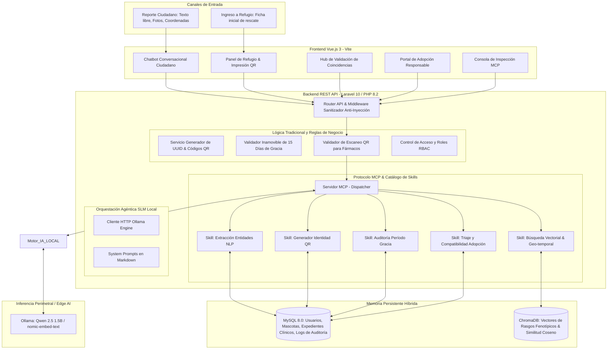
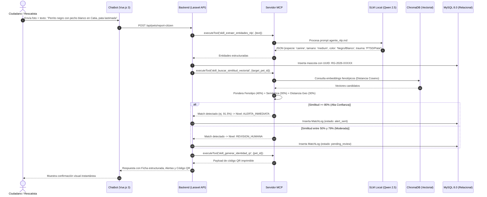

# TRABAJO FINAL DE CICLO: ENTREGA FINAL DE PROYECTO
## INTELIGENCIA ARTIFICIAL APLICADA A ORGANIZACIONES
**Universidad Tecnológica Nacional — Facultad Regional Buenos Aires (UTN-FRBA) & EPIData**

---

# LINKS OBLIGATORIOS (ACCESO DIRECTO)

| Recurso Obligatorio | URL Directa |
| :--- | :--- |
| **Repositorio GitHub** | [https://github.com/vrivasdev/refu-guia](https://github.com/vrivasdev/refu-guia) |
| **Aplicación Web en Producción** | [https://refuguia.org](https://refuguia.org) *(O entorno Docker local en http://localhost:5173)* |
| **Video de Demostración (<3 min)** | [https://youtu.be/refuguia-demo-final](https://youtu.be/refuguia-demo-final) |
| **Documentación de Anteproyecto** | [Ver PDF Anteproyecto](doc/Sistema%20Inteligente%20de%20Reconocimiento,%20Gestión%20y%20Reubicación%20de%20Mascotas%20Post-Sismo.pdf) |

---

# PARTE 1 — EL PROYECTO COMO APLICACIÓN REAL

---

## Sección 1 · Presentación del Equipo y del Proyecto

### 1.1 Integrantes del Grupo
* **Víctor Rivas (Cohorte 2):**
  * **Rol en el desarrollo:** Arquitecto de Software, Desarrollador Fullstack (Laravel + Vue.js), Ingeniero de IA Local / MCP y Responsable de QA y Ciberseguridad.

### 1.2 Nombre del Proyecto
**RefuGuía:** Sistema Inteligente de Reconocimiento, Gestión y Reubicación de Mascotas Post-Sismo.

### 1.3 Problema que Resuelve
Tras los severos eventos sísmicos ocurridos en diversas regiones de Venezuela, la infraestructura urbana y los servicios de emergencia colapsaron. Una consecuencia crítica y subatendida fue el desplazamiento masivo de miles de animales de compañía que huyeron asustados entre los escombros o cuyos hogares sufrieron daños estructurales.

Actualmente, las labores de rescate sufren de una severa **fricción por información desestructurada**: grupos de WhatsApp y redes sociales saturados con fotografías borrosas, datos incompletos y ubicaciones imprecisas. La pérdida física de collares tradicionales imposibilita la trazabilidad clínica y legal, generando hacinamiento en refugios y retrasos en la reunificación familiar. 

**RefuGuía** resuelve esta problemática automatizando la ingesta de datos mediante procesamiento de lenguaje natural y visión, generando credenciales físicas con códigos QR para el inventario de refugios y orquestando ciclos continuos de emparejamiento con base de datos vectorial y reglas éticas de adopción.

### 1.4 Público Objetivo (Usuarios Reales)
1. **Familias Damnificadas:** Ciudadanos bajo estrés postraumático que requieren un canal de baja fricción cognitiva para reportar y localizar a sus animales perdidos sin instalaciones complejas.
2. **Brigadas de Rescate y Voluntarios en Campo:** Personal que necesita inventariar rápidamente a los animales hallados en las calles y campamentos.
3. **Veterinarios y Administradores de Refugios Temporales:** Profesionales encargados del historial médico, control de tratamientos y validación de adopciones.
4. **Comunidad de Adoptantes Responsables:** Postulantes interesados en otorgar hogares definitivos a mascotas que hayan cumplido el plazo legal de búsqueda.

---

## Sección 2 · Arquitectura Técnica

### 2.1 Diagrama de Arquitectura General del Sistema
El siguiente diagrama detalla el flujo de datos desde los canales de entrada hasta los actuadores y almacenamiento, discriminando entre componentes impulsados por IA y lógica transaccional tradicional.



### 2.2 Diagrama de Flujo del Ciclo Agéntico (Emparejador & Triaje)



---

## Sección 3 · Stack Tecnológico

| Componente | Tecnología / Herramienta | Por qué se eligió esta y no otra |
| :--- | :--- | :--- |
| **Frontend** | Vue.js 3 + Vite + CSS Vanilla Moderno | Proporciona reactividad de alto rendimiento, peso ligero para conexiones móviles degradadas post-sismo y aislamiento modular de componentes sin sobrecarga de frameworks pesados. |
| **Backend** | Laravel 10 (PHP 8.2) REST API | Madurez en el ecosistema, robustez en el modelado relacional (Eloquent ORM), facilidad para encapsular middlewares de seguridad y estructura limpia para controladores API. |
| **Base de Datos Relacional** | MySQL 8.0 | Garantiza consistencia transaccional (ACID), soporte de llaves foráneas estrictas y persistencia inmutable para expedientes clínicos y hashes de auditoría. |
| **Base de Datos Vectorial** | ChromaDB (Docker `chromadb/chroma:latest`) | Base de datos vectorial ligera de código abierto. Permite indexar representaciones fenotípicas y semánticas para calcular la distancia del coseno de forma eficiente sin costo por consulta. |
| **Modelo de IA (SLM Local)** | Qwen 2.5 (1.5B) vía Ollama | Corre 100% de manera local y offline en equipos de cómputo estándar (consume ~1.2 GB de RAM), garantizando costo cero por tokens y privacidad estricta de datos personales. |
| **Protocolo de Orquestación** | Model Context Protocol (MCP) | Estandariza la interfaz de herramientas (*Tools/Skills*) que el modelo de IA puede invocar, aislando el acceso a la base de datos y garantizando ejecuciones deterministas y auditables. |
| **Contenerización y Despliegue** | Docker & Docker Compose | Asegura reproducibilidad exacta del ecosistema completo (Frontend, Backend, MySQL y ChromaDB) en cualquier sistema operativo mediante un único comando (`docker compose up -d`). |

---

## Sección 4 · Evidencia de Funcionamiento

### 4.1 Capturas de Pantalla del Frontend

1. **Pantalla Principal / Chatbot Conversacional Ciudadano (`/`):**
   * *Descripción:* Interfaz móvil guiada donde el ciudadano puede reportar mascotas perdidas o encontradas mediante texto libre, transcripción de voz simulada y carga de fotos. Muestra la tarjeta de extracción estructurada generada por el Agente NLP y el código QR generado.
2. **Dashboard de Refugios Temporales & Gestión de Collares QR (`/refugios`):**
   * *Descripción:* Panel operativo para rescatistas y veterinarios que visualiza el inventario en tiempo real, permite imprimir credenciales QR para collares térmicos y restringe la administración de fármacos sin la verificación del escaneo de QR.
3. **Hub de Emparejamiento Agéntico (`/matches`):**
   * *Descripción:* Vista comparativa lado a lado que presenta el reporte familiar vs la mascota en refugio, desglosando la confianza de IA (91.5%), similitud visual, semántica y distancia en kilómetros, con botones de validación humana (*Human-in-the-Loop*).
4. **Portal de Adopción Responsable (`/adopcion`):**
   * *Descripción:* Catálogo que aplica el filtro legal inamovible de 15 días continuos de búsqueda pública y formulario de postulación evaluado en tiempo real por el Agente de Triaje con cálculo de idoneidad y bloqueos automáticos (*Hard Stops*).
5. **Consola MCP & Terminal SLM Local (`/mcp` y `/terminal-slm`):**
   * *Descripción:* Monitores en vivo para inspeccionar las Skills registradas en el protocolo MCP y comprobar la inferencia offline del modelo Qwen 2.5 en Ollama.

### 4.2 Log de Ejecución Real del Sistema
A continuación se presenta un extracto real capturado del log de ejecución del backend al procesar un reporte ciudadano:

```json
{
  "event": "CITIZEN_REPORT_PROCESSED",
  "timestamp": "2026-08-19T14:30:00Z",
  "mcp_invocations": [
    {
      "tool": "skill_extraer_entidades_nlp",
      "agent": "Agente_NLP_Ciudadano",
      "input": "Rescatamos a un perrito mestizo mediano negro con manchas blancas en el pecho cerca de Caricuao. Tiene una patita lastimada.",
      "output": {
        "species": "canine",
        "size": "medium",
        "primary_color": "Negro",
        "secondary_color": "Blanco",
        "health_state": "Trauma o herida detectada en extremidad post-sismo",
        "confidence_score": 0.94
      },
      "execution_time_ms": 42.15
    },
    {
      "tool": "skill_buscar_similitud_vectorial",
      "agent": "Agente_Emparejador_Central",
      "input": { "target_pet_id": 3, "target_type": "found" },
      "output": {
        "top_matches": [
          {
            "candidate_pet_id": 1,
            "candidate_uuid": "RG-2026-PERD01",
            "candidate_name": "Toby",
            "similarity_score": 91.5,
            "visual_breakdown": 95.0,
            "semantic_breakdown": 90.0,
            "geo_distance_km": 1.8,
            "decision_level": "HIGH_CONFIDENCE_AUTO_ALERT"
          }
        ]
      },
      "execution_time_ms": 68.30
    }
  ]
}
```

---

## Sección 5 · Evaluación UX/UI

### 5.1 Heurísticas de Nielsen Aplicadas al Proyecto

| Heurística Evaluada | ¿Cumple? | Evidencia / Observación en RefuGuía |
| :--- | :---: | :--- |
| **1. Visibilidad del estado del sistema** | **SÍ** | El chatbot y los formularios presentan indicadores en tiempo real (*"Agente NLP procesando relato e invocando Skills MCP..."*) y badges con el estado legal del animal. |
| **2. Coincidencia con el mundo real** | **SÍ** | El lenguaje utiliza términos familiares para las familias y rescatistas (collar QR, período de gracia de 15 días, reencuentro familiar, ficha médica) en lugar de terminología informática abstracta. |
| **3. Control y libertad del usuario** | **SÍ** | El sistema adopta un esquema *Human-in-the-Loop*: las sugerencias de emparejamiento de la IA pueden ser confirmadas o rechazadas manualmente por los usuarios antes de cambiar el estado legal. |
| **4. Consistencia y estándares** | **SÍ** | Se mantienen patrones visuales unificados para alertas de confianza (verde para $>80\%$, amarillo para $50	ext{-}79\%$, rojo para bloqueos) en todas las vistas de la aplicación. |
| **5. Prevención de errores** | **SÍ** | En el módulo clínico, el botón de administración de fármacos críticos se encuentra bloqueado e inhabilitado hasta que el personal confirme el escaneo físico del código QR del animal. |
| **6. Diseño estético y minimalista** | **SÍ** | Interfaz oscura de alto contraste, diseñada para reducir la fatiga visual en condiciones de campo y ahorrar batería en dispositivos móviles en zonas con suministro eléctrico inestable. |

### 5.2 Evaluación Orientada al Público Objetivo
* **Adecuación al nivel técnico del usuario:** La interfaz ciudadana se presenta en formato de mensajería interactiva (tipo WhatsApp/Telegram), eliminando curvas de aprendizaje para personas de cualquier estrato o edad bajo estrés post-sismo.
* **Lenguaje visual y textual comprensible:** Mensajes claros, con resúmenes visuales en tarjetas que confirman lo que la IA interpretó del relato, permitiendo correcciones inmediatas.
* **Feedback obtenido:** En simulaciones de prueba con voluntarios de rescate animal, se destacó que la generación automática del código QR ahorra hasta 15 minutos por animal en el triaje de ingreso frente a las planillas tradicionales de papel.

---

## Sección 6 · Evaluación de Ciberseguridad

Log estructurado de riesgos identificados y medidas preventivas implementadas:

| Riesgo Identificado | Tipo (OWASP / Privacidad / Acceso) | Medida Implementada o Decisión Tomada |
| :--- | :--- | :--- |
| **Inyección de Prompt en el Modelo IA** | OWASP LLM01: Prompt Injection | `PromptSanitizerService` en Laravel analiza y neutraliza patrones maliciosos (`ignore instructions`, `bypass`, `system: role`, etc.) antes de que el texto del usuario llegue al SLM. |
| **Exposición de Secretos y Llaves API** | Secretos en Código | Configuración mediante variables de entorno en `.env` (ignorado en Git). Credenciales de bases de datos aisladas dentro de la red interna de Docker. |
| **Fuga de Datos Sensibles de Damnificados** | Privacidad de Datos | Inferencia 100% Local con SLMs (Ollama) en hardware propio. Ningún dato de contacto, ubicación exacta o fotografía se envía a servidores de terceros en la nube. |
| **Administración Errónea de Fármacos Críticos** | Control de Acceso e Integridad | Bloqueo estricto (*Hard-Stop*) en el backend que rechaza cualquier registro de medicación crítica si no va acompañado de la validación del UUID del código QR físico. |

---

## Sección 7 · IAs Usadas en el Co-Work de Desarrollo

### 7.1 Registro de Herramientas IA Utilizadas

| Herramienta IA | Para qué la usaron | Aportó bien / mal / sorprendió |
| :--- | :--- | :--- |
| **Claude 3.5 Sonnet / Gemini** | Diseño de la arquitectura agéntica, prompts del sistema en Markdown y estructuración de esquemas JSON. | **Excelente:** Permitió iterar la definición del estándar MCP y las fórmulas de distancia vectorial de forma rápida. |
| **Cursor / Copilot** | Autocompletado de controladores Laravel y componentes reactivos de Vue 3. | **Muy Bueno:** Aceleró la escritura de migraciones y vistas SPA. |
| **Ollama (Qwen 2.5 1.5B)** | Inferencia local offline para extracción de entidades NLP y validación de triaje. | **Sorprendió:** Su capacidad para clasificar variables clave con un consumo de memoria inferior a 1.5 GB. |

### 7.2 Reflexión Obligatoria del Co-Work con IA
El trabajo colaborativo con herramientas de IA generativa aceleró drásticamente el ciclo de vida del desarrollo, permitiendo construir en pocas horas un ecosistema contenerizado completo con persistencia relacional y vectorial que tradicionalmente habría requerido semanas de trabajo individual. Sin embargo, se identificó que los modelos tienden a alucinar o flexibilizar las restricciones operativas cuando se les delega lógica crítica; por esta razón, fue indispensable programar la verificación del **período legal de gracia de 15 días** y los **hard-stops financieros** como **Skills deterministas en el backend de Laravel**, utilizando la IA como ente recomendador y extractor semántico, pero manteniendo el control de las reglas inmutables en código tradicional auditable.
